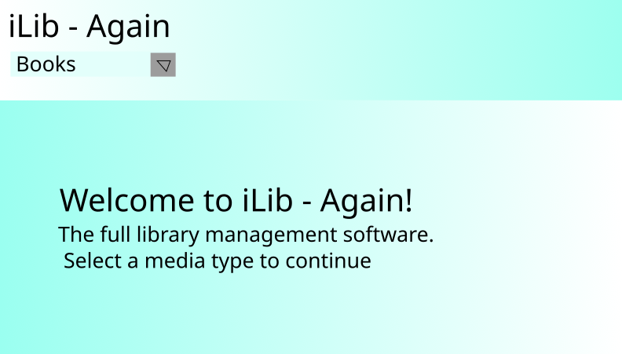
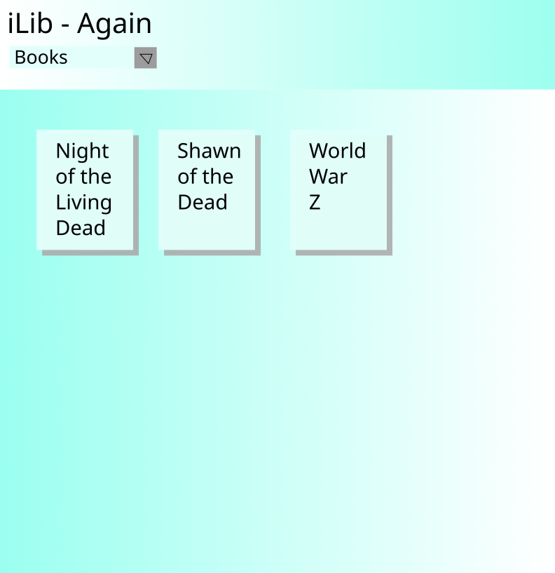
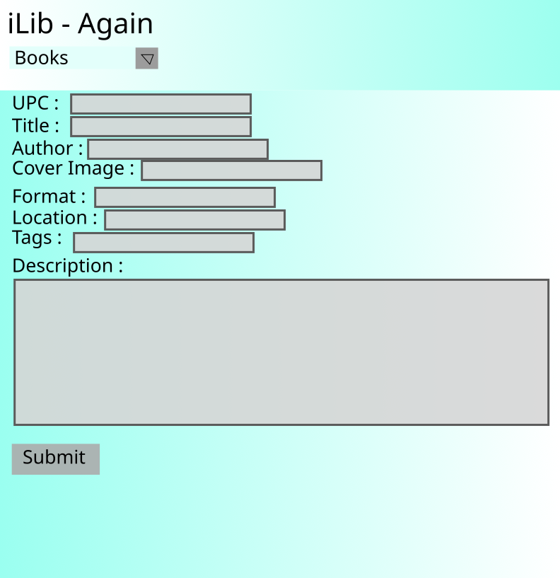

# iLib_Again
A MongoDB / Node.js / Express.js Library management web app.

## Project Description
> Include: 
> General App Idea/Purpose 

Track media assets owned and location of said assets

> Models including field names and their datatypes 

User
* username - string, unique, required
* password - string, required
* admin - boolean (false(normal user), or true(admin user access)) required(default - false)

Media
* upc - string, unique
* title - string
* creator_name - string
* creator_type - string (artist, director, author, etc.)
* cover - string (link to image)
* cover_alt - string
* format - string (book, mag, cd , mp3, dvd, etc.)
* location - string (room, shelf, directory, etc.)
* tags - array of string (genre, etc.)
* desc - string (summary or description)

> A list of routes (e.g. `POST /pins/ allows users to post a picture of a pin`) 
GET     / display landing page

GET     /user/register allow user to create an account
POST    /user/register allow user to create an account
GET     /user/edit allow user to change the password
POST    /user/edit allow user to change the password
GET     /user/signin display form for user to sign in
POST    /user/signin sign user into the app
GET     /user/signout allow user to sign out of app

GET     INDEX   /media/         index of media entries filtered by media type selected from dropdown
GET     NEW     /media/new      display form to add new media to library
GET     SHOW    /media/:id      display info of one media document
GET     EDIT    /media/:id/edit display form prepopulated with data to edit a document
POST    CREATE  /media/         create a new document in the media collection
DELETE  DESTROY /media/:id      delete document with _id: id from collection
PUT     UPDATE  /media/:id      update document with new values from the edit form

## Wireframes

## User Stories
* User stories detailing app functionality 
* As a Normal User I want to be able to create a user account.
* As a Normal User I want to be able to edit my account / change password.
* As a Normal User I want to be able to browse the titles currently entered into my library database.
* As a Normal User I want to be able to add titles into my library database.
* As a Normal User I want to be able to edit the titles currently entered in my library database.
* As a Normal User I want to be able to delete titles from my database.

* As an Admin User I want to be able to browse the titles currently entered into the database for all users.
* As an Admin User I want to be unable to add titles into the database.
* As an Admin User I want to be able to edit and delete titles currently entered into the database for all users.

### MVP Goals
* All Normal User type User Stories

### Stretch Goals
* All Admin user type stories
* look up title info from an online api based on the upc code entered or scanned into the page.
